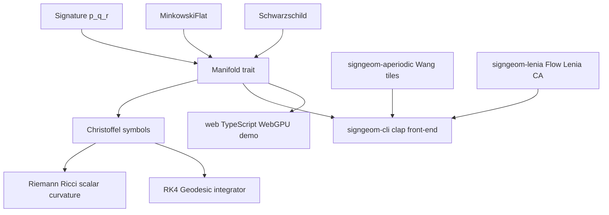

# signgeom

[](#license)
[](rust-toolchain.toml)
[]()

**Signature-parametric Riemannian / pseudo-Riemannian geometry in Rust, with a WebGPU front-end.**

signgeom is a small computational geometry library that treats the *signature*
of a metric — `(p, q, r)`, the number of positive, negative, and degenerate
eigenvalues — as a first-class type parameter. The same kernel computes
geodesics, Christoffel symbols, and curvature tensors across Euclidean,
Minkowski, split-signature, and degenerate geometries, all from a single
generic code path.

## Architecture



## What is this?

A given spacetime or abstract manifold has a metric with a *signature* — the
pattern of +1/−1/0 along its diagonal. Classical Riemannian geometry uses all
+1 (positive-definite); special relativity uses (3,1) or (1,3) Minkowski
spacetime; Greg Egan's *Orthogonal* novels explore a universe with all +1 but
where the time dimension has the same sign as the spatial ones.

signgeom lets you write `Signature::minkowski(4)` or `Signature::orthogonal4()`
and run the exact same Christoffel / geodesic / curvature code in each
geometry without branching. The WebGPU front-end validates the CPU path in
the browser via a parallel WGSL compute kernel.

| Signature | Familiar name | Where it appears |
|---|---|---|
| `(n, 0, 0)` | Riemannian | classical geometry, machine learning |
| `(n−1, 1, 0)` | Lorentzian / Minkowski | relativity, the universe we live in |
| `(4, 0, 0)` | "Orthogonal" | Greg Egan's *Orthogonal* trilogy |
| `(2, 2, 0)` | split / neutral | Egan's *Dichronauts* |
| `(p, q, r)` with `r > 0` | degenerate | Galilean / Newton–Cartan |

## Quickstart

```bash
cargo build --release
cargo test --workspace
cargo run -p signgeom-cli -- --help

# Bundled examples (run in signgeom-core)
cargo run -p signgeom-core --example light_cone_orthogonal
cargo run -p signgeom-core --example dichronauts_geodesic
cargo run -p signgeom-core --example schwarzschild_compare
```

## How it works

1. **`Signature { p, q, r }`** is a small const-constructible value type. Named
   constructors cover the common cases: `Signature::riemannian(n)`,
   `minkowski(n)`, `orthogonal4()`, `dichronauts4()`, `galilean(n)`.

2. **`Manifold` trait** — implement `metric(x) -> MetricTensor` (and optionally
   analytic partial derivatives). When derivatives are omitted, the library
   falls back to second-order central finite differences with step `1e-3`.

3. **Pure functions** — `christoffel`, `riemann`, `ricci`, `scalar_curvature`,
   `integrate_geodesic` operate on `&dyn Manifold`. The RK4 integrator takes
   a `GeodesicConfig` (steps, affine-parameter range) and returns a
   `Vec<GeodesicState>`.

4. **WebGPU demo** (`web/`) — a TypeScript app that spawns a WGSL compute
   shader alongside the CPU flat-metric integrator for four metric signatures,
   overlays both results on a Canvas2D canvas, and reports the CPU/GPU
   endpoint delta. Falls back to CPU-only when WebGPU is unavailable.

5. **`signgeom-aperiodic`** — Wang-tile matching rules, east/north adjacency,
   and a small Turing-machine-to-tile-set compiler.

6. **`signgeom-lenia`** — Flow-Lenia-style continuous cellular automaton on a
   flat Euclidean background.

## Features (v0.1.x)

- **`signgeom-core`** — `Signature`, `Manifold` trait, Christoffel symbols,
  Riemann / Ricci / scalar curvature, RK4 geodesic integrator, built-in
  `MinkowskiFlat` and `Schwarzschild` manifolds.
- **`signgeom-aperiodic`** — Wang-tile adjacency rules and Turing-machine
  compiler; 2023 einstein-hat monotile is on the v0.1.x roadmap.
- **`signgeom-lenia`** — Flow-Lenia-style CA; signature-aware kernel is on
  the v0.2 roadmap.
- **`signgeom-cli`** — `clap`-based command-line front-end covering all
  sub-libraries.
- **`web/`** — TypeScript / WebGPU browser demo with Canvas2D rendering; CPU
  and GPU paths render side-by-side for visual comparison (not bitwise).

## Greg Egan note (please read)

The mathematical themes of signgeom were inspired by Greg Egan's *Orthogonal*
trilogy, *Dichronauts*, *Schild's Ladder*, *Permutation City*, *Wang's
Carpets* and *Diaspora*. Every formula in this repository was independently
re-derived from public-domain mathematics (textbooks, arXiv preprints,
peer-reviewed papers). **No code, applet source or asset from
[gregegan.net](https://www.gregegan.net) has been inspected or copied.**

signgeom is not endorsed by or affiliated with Greg Egan.

See [`docs/book/src/license-strategy.md`](docs/book/src/license-strategy.md).

## Status

This is an early alpha. The public API may break before v1.0. Numerical
results should be regarded as "directionally correct" until a v1.0 release —
property tests cover sign-invariants, Schwarzschild Ricci-flatness is checked
to ≤ 5e-3 absolute (the dominant cost is fourth-derivative finite-difference
noise), and long geodesic integrations on WebGPU `f32` may drift.

## Contributing

See [`CONTRIBUTING.md`](CONTRIBUTING.md). All conversations are governed by
the [`CODE_OF_CONDUCT.md`](CODE_OF_CONDUCT.md).

## License

Licensed under either of

- Apache License, Version 2.0 ([LICENSE-APACHE](LICENSE-APACHE) or http://www.apache.org/licenses/LICENSE-2.0)
- MIT license ([LICENSE-MIT](LICENSE-MIT) or http://opensource.org/licenses/MIT)

at your option.

### Contribution

Unless you explicitly state otherwise, any contribution intentionally submitted
for inclusion in the work by you, as defined in the Apache-2.0 license, shall
be dual licensed as above, without any additional terms or conditions.
